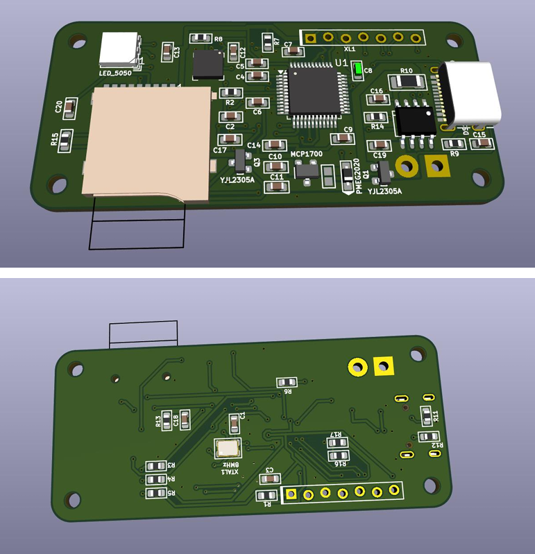

Gyroscope Data Logger (STM32F103C8T6)
Overview
This project is an autonomous data logging device built around the STM32F103C8T6 (Blue Pill) microcontroller. It reads real-time data from a gyroscope sensor and saves the logs directly onto an SD card. The device is designed for portability, powered by a LiPo battery featuring convenient USB charging.

Photo Gallery

<em>The fully assembled Gyroscope Data Logger.</em>

<em>The fully assembled Gyroscope Data Logger.</em>

🚀 Key Features
Microcontroller: STM32F103C8T6 (Cortex-M3).

Sensor: High-precision Gyroscope (interfaced via I2C).

Data Storage: Reliable data logging to a MicroSD card. Support for .txt or .csv formats (implemented using the FatFs stack).

Power System: Portable LiPo battery operation with an integrated USB charging circuit.

Communication Interfaces:

SPI: Used for high-speed communication with the SD card module.

I2C: Used for retrieving sensor data from the gyroscope.

UART: Available for debugging purposes.
